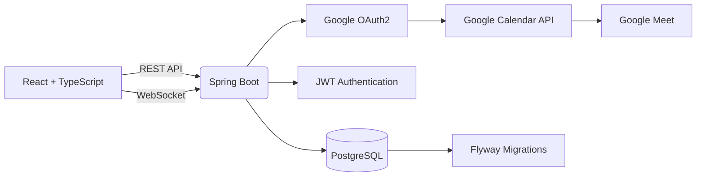

# Knowledge Nexus

<div align="center">

# 🎓 Knowledge Nexus

### Connect • Learn • Mentor • Grow

*A modern mentorship platform that enables professionals and students to discover mentors, collaborate through dedicated mentorship workspaces, and conduct real Google Meet mentoring sessions.*

---


</div>

---

# ✨ Why Knowledge Nexus?

Knowledge Nexus is designed to solve a common problem inside companies, universities, and developer communities—finding the right mentor and managing mentorship professionally.

Instead of a generic chat application, every mentorship becomes its own collaborative workspace with:

* Dedicated mentorship lifecycle
* Separate conversation history
* Google Meet integration
* Skill-based mentor reputation
* Organization-aware mentor discovery

---

# 🚀 Core Features

## 👨‍🏫 Mentor Discovery

* Search mentors by skill
* Filter mentors by organization
* Experience-based mentor profiles
* Skill recommendations
* Mentor availability

---

## 🤝 Mentorship Lifecycle

```text
Discover Mentor
      │
      ▼
Send Request
      │
      ▼
Accept / Reject
      │
      ▼
Dedicated Chat Room
      │
      ▼
Schedule Google Meet
      │
      ▼
Conduct Mentorship
      │
      ▼
Rate Mentor Skill
      │
      ▼
Archive Conversation
```

Each accepted mentorship creates an independent conversation. Multiple mentorships between the same mentor and mentee never overwrite previous discussions.

---

## 💬 Real-Time Collaboration

* WebSocket messaging
* Typing indicators
* Online presence
* Conversation history
* Archived mentorship chats
* Read-only completed mentorships

---

## 📅 Google Meet Integration

Knowledge Nexus integrates directly with Google Calendar.

When a mentorship request is accepted:

* Organizer authenticates with Google OAuth2
* Backend creates Calendar Event
* Google automatically generates Meet link
* Both users receive the same meeting

Meet links support:

* Automatic expiration
* Manual deletion
* Created by Me
* Shared with Me

---

## ⭐ Dynamic Mentor Reputation

Each mentor owns their self-assessed skill level.

After every mentorship:

* Mentee reviews only the skill that was taught.
* Community feedback slightly adjusts the mentor's displayed expertise while preserving the mentor's own assessment.

---

# 🏛 System Architecture



---

# 📂 Project Structure

```text
knowledge-nexus/

├── backend/
│   ├── src/main/java/com/knowledgenexus
│   │   ├── config/
│   │   ├── controller/
│   │   ├── dto/
│   │   ├── model/
│   │   ├── repository/
│   │   ├── security/
│   │   ├── service/
│   │   └── websocket/
│   │
│   └── src/main/resources
│       ├── application.yml
│       └── db/migration
│
└── frontend/
    ├── src
    │   ├── components
    │   ├── context
    │   ├── hooks
    │   ├── pages
    │   ├── services
    │   ├── types
    │   └── utils
    └── public
```

---

# ⚙ Backend Configuration

## application.yml

```yaml
server:
  port: 8080

spring:
  application:
    name: knowledge-nexus

  datasource:
    url: jdbc:postgresql://localhost:5432/knowledge_nexus
    username: postgres
    password: your_password
    driver-class-name: org.postgresql.Driver

  jpa:
    hibernate:
      ddl-auto: validate
    show-sql: false

  flyway:
    enabled: true
    locations: classpath:db/migration

app:
  frontend-url: http://localhost:5173

  cors:
    allowed-origins:
      - http://localhost:5173

  jwt:
    secret: CHANGE_ME
    expiration-ms: 86400000

google:
  client-id: YOUR_CLIENT_ID
  client-secret: YOUR_CLIENT_SECRET
  redirect-uri: http://localhost:8080/api/google/oauth/callback
```

---

# 💻 Frontend

## .env.example

```env
VITE_API_BASE_URL=http://localhost:8080/api

VITE_GOOGLE_CLIENT_ID=YOUR_GOOGLE_CLIENT_ID

VITE_APP_NAME=Knowledge Nexus
```

---

# 🚀 Running Locally

### Backend

```bash
cd backend
./mvnw spring-boot:run
```

### Frontend

```bash
cd frontend

npm install

npm run dev
```

---

# 🧩 Tech Stack

| Layer          | Technology              |
| -------------- | ----------------------- |
| Frontend       | React, TypeScript, Vite |
| Backend        | Spring Boot, Java 21    |
| Authentication | JWT, Google OAuth2      |
| Database       | PostgreSQL              |
| ORM            | Spring Data JPA         |
| Realtime       | WebSocket + STOMP       |
| Calendar       | Google Calendar API     |
| Video          | Google Meet             |
| Migration      | Flyway                  |

---

# 📌 Roadmap

* AI Mentor Recommendation
* AI Session Summary
* Resume-based Mentor Matching
* Calendar Sync
* Docker Deployment
* Kubernetes Support
* CI/CD Pipeline
* Mobile App
* Analytics Dashboard

---

# 👨‍💻 Author

**Vishal Kesharwani**

Full Stack Developer • Java • Spring Boot • React • Cloud

If this project helped you or inspired you, consider giving it a ⭐ on GitHub.
