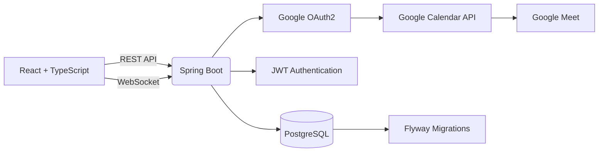

# Knowledge Nexus

<div align="center">

# 🎓 Knowledge Nexus

### Connect • Learn • Mentor • Grow

*A modern mentorship platform that enables professionals and students to discover mentors, collaborate through dedicated mentorship workspaces, and conduct real Google Meet mentoring sessions.*

[](https://openjdk.org/)
[](https://spring.io/projects/spring-boot)
[](https://react.dev/)
[](https://www.typescriptlang.org/)
[](https://www.postgresql.org/)
[](https://jwt.io/)
[](https://developers.google.com/calendar)

</div>

---

## ✨ Why Knowledge Nexus?

Finding the right mentor — and managing that relationship professionally — is a problem most companies, universities, and developer communities solve badly, usually with ad-hoc DMs and spreadsheets.

Knowledge Nexus turns every mentorship into its own structured, collaborative workspace:

- Dedicated mentorship lifecycle (request → accept → chat → meet → review)
- Isolated conversation history per mentorship (no overwritten threads)
- Native Google Meet scheduling
- Skill-based, community-adjusted mentor reputation
- Organization-aware mentor discovery

---

## 🚀 Core Features

### 👨‍🏫 Mentor Discovery
- Search mentors by skill
- Filter by organization
- Experience-based mentor profiles with skill recommendations
- Mentor availability visibility

### 🤝 Mentorship Lifecycle

```text
Discover Mentor → Send Request → Accept / Reject → Dedicated Chat Room
        → Schedule Google Meet → Conduct Mentorship → Rate Mentor Skill → Archive
```

Each accepted mentorship spins up an independent conversation — multiple mentorships between the same two people never overwrite prior history.

### 💬 Real-Time Collaboration
- WebSocket-based messaging (STOMP)
- Typing indicators & online presence
- Full conversation history, with read-only archived threads

### 📅 Google Meet Integration
On mentorship acceptance, Knowledge Nexus authenticates via Google OAuth2, creates a Calendar event through the Google Calendar API, and auto-generates a Meet link shared with both participants — supporting expiration and manual deletion, with "Created by Me" / "Shared with Me" views.

### ⭐ Dynamic Mentor Reputation
Mentors self-assess their skill level; post-mentorship reviews from mentees nudge the displayed expertise score without overriding the mentor's own baseline assessment.

---

## 🏛 System Architecture


```mermaid
flowchart LR
    A[React + TypeScript] -->|REST API| B(Spring Boot)
    A -->|WebSocket| B
    B --> C[(PostgreSQL)]
    B --> D[JWT Authentication]
    B --> E[Google OAuth2]
    E --> F[Google Calendar API]
    F --> G[Google Meet]
    C --> H[Flyway Migrations]
```

---

## 🧩 Tech Stack

| Layer          | Technology               |
|----------------|---------------------------|
| Frontend       | React, TypeScript, Vite  |
| Backend        | Spring Boot, Java 21     |
| Authentication | JWT, Google OAuth2       |
| Database       | PostgreSQL                |
| ORM            | Spring Data JPA           |
| Realtime       | WebSocket + STOMP          |
| Calendar       | Google Calendar API      |
| Video          | Google Meet                |
| Migration      | Flyway                    |
| Local Infra    | Docker Compose (PostgreSQL) |

---

## 📂 Project Structure

```text
knowledge-nexus/
├── backend/
│   ├── src/main/java/com/knowledgenexus
│   │   ├── config/
│   │   ├── controller/
│   │   ├── dto/
│   │   ├── model/
│   │   ├── repository/
│   │   ├── security/
│   │   ├── service/
│   │   └── websocket/
│   └── src/main/resources
│       ├── application.yml
│       └── db/migration
└── frontend/
    ├── src
    │   ├── components
    │   ├── context
    │   ├── hooks
    │   ├── pages
    │   ├── services
    │   ├── types
    │   └── utils
    └── public
```

---

## ⚙️ Configuration

Copy the example files and fill in real values locally — never commit secrets.

- Backend: `backend/src/main/resources/application.example.yaml` → `application.yaml`
- Root: `.env.example` → `.env`
- Frontend: `frontend/.env.example` → `frontend/.env`

**Backend (`application.yml`) key sections:**
```yaml
spring:
  datasource:
    url: ${SPRING_DATASOURCE_URL:jdbc:postgresql://localhost:5432/knowledge_nexus}
  flyway:
    enabled: true
    locations: classpath:db/migration

google:
  client-id: ${GOOGLE_CLIENT_ID:change-me-client-id}
  client-secret: ${GOOGLE_CLIENT_SECRET:change-me-client-secret}
  redirect-uri: http://localhost:8080/api/google/oauth/callback

jwt:
  secret: ${JWT_SECRET:change-me-jwt-secret}
  expiration-ms: ${JWT_EXPIRATION_MS:86400000}
```

**Frontend (`.env`):**
```env
VITE_API_BASE_URL=http://localhost:8080/api
VITE_GOOGLE_CLIENT_ID=YOUR_GOOGLE_CLIENT_ID
VITE_APP_NAME=Knowledge Nexus
```

---

## 🚀 Running Locally

**Backend**
```bash
cd backend
./mvnw spring-boot:run
```

**Frontend**
```bash
cd frontend
npm install
npm run dev
```

**Database (Docker)**
```bash
docker compose up --build
```
Starts PostgreSQL on `localhost:5432`. Backend connects to it via environment variables defined in `docker-compose.yml` and runs separately via Maven.

---

## 📌 Roadmap

- [ ] AI mentor recommendation
- [ ] AI-generated session summaries
- [ ] Resume-based mentor matching
- [ ] Calendar sync (two-way)
- [ ] Kafka-based event-driven notifications
- [ ] Full Docker deployment (backend + frontend containerized)
- [ ] Kubernetes support
- [ ] CI/CD pipeline
- [ ] Mobile app
- [ ] Analytics dashboard

---

## 👨‍💻 Author

**Vishal Kesharwani**
Full Stack Developer • Java • Spring Boot • React • Cloud

If this project helped or inspired you, consider giving it a ⭐ on GitHub.
